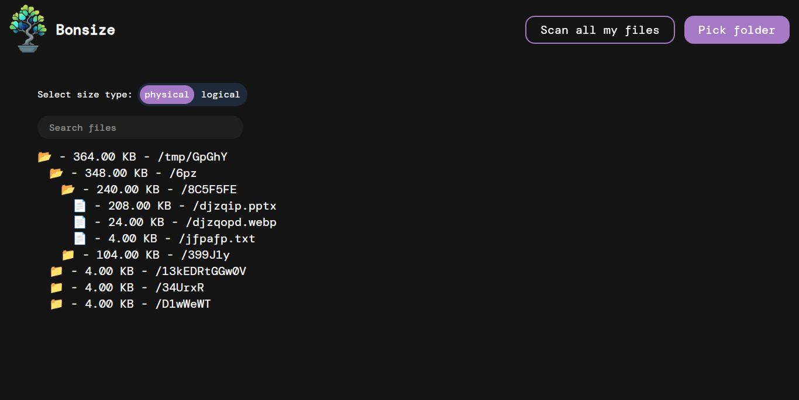

# bonsize 🐢

A CLI tool to display directory tree sizes.

## Description

`bonsize` allows you to quickly analyze and display the size of directories and files in a tree structure, making it easy to identify which files and folders are taking up the most disk space. It comes with both a fast Command-Line Interface (CLI) and an interactive Graphical User Interface (GUI).

## Graphical User Interface (GUI)

The `bonsize-gui` application provides an interactive, visual way to explore your disk space usage. 



You can launch the GUI directly from your desktop application launcher or by running the following command in your terminal:

```bash
bonsize-gui
```

## CLI Usage

```bash
bonsize [OPTIONS] [PATH]
```

### Arguments

- `[PATH]` - The directory path to analyze (default: current directory `.`)

### Options

- `-F, --file` - Show files in the output
- `-D, --directory` - Show only directories
- `-d, --depth <MAX_DEPTH>` - Maximum depth to traverse
- `-s, --sorted [<SORT>]` - Sort output (possible values: `asc`, `desc`)
- `--csv [<CSV>]` - Export results to CSV format
- `-c, --cache` - Use caching for improved performance
- `-q, --quiet` - Suppress non-essential output
- `-l, --logical-size` - Show logical size instead of physical size
- `-h, --help` - Print help information
- `-V, --version` - Print version information

### Examples

```bash
$ bonsize /folder
📂 - folder 109.15MB
  📂 - folder/videos 104.79MB
    📂 - folder/videos/2026 87.19MB
      📄 - folder/videos/2026/vacation_2026_02.mp4 87.19MB
    📂 - folder/videos/2025 17.60MB
      📄 - folder/videos/2025/Replay_2026-03-12_20-05-46.mp4 17.60MB
  📂 - folder/turtle pictures 4.36MB
    📄 - folder/turtle pictures/image_2.png 4.32MB
    📄 - folder/turtle pictures/image_1.jpg 40.00KB
  📄 - folder/letter.txt 4.00KB
```

```bash
# Show only directories, sorted by size
$ bonsize -D -s desc

# Limit depth and use cache
$ bonsize -d 3 -c
```


## Installation

All releases are available on the [releases section](https://github.com/MathieuMarthy/bonsize/releases)

### Install only the CLI
#### For Linux

##### Debian/Ubuntu

Download the `.deb` package and install it:

```bash
sudo dpkg -i bonsize_*-CLI.deb
```

##### Universal linux

For the moment, on other distros you can use the tar.gz


#### For windows

*soon*

### Install only the GUI

###### Debian/Ubuntu
Download the `.deb` package and install it:

```bash
sudo dpkg -i bonsize_*-GUI.deb
```

##### AppImage

```bash
chmod +x bonsize_*-GUI.AppImage
./bonsize_*-GUI.AppImage
```

## License

This project is licensed under the WTFPL, see the [license file](./LICENSE) for more details.
